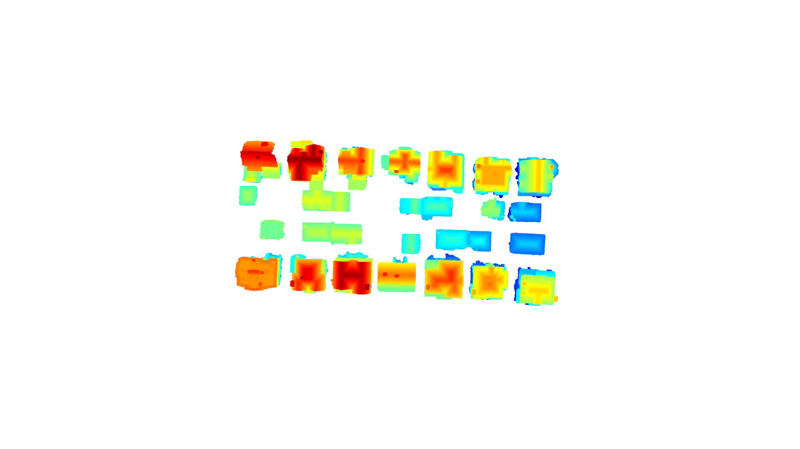
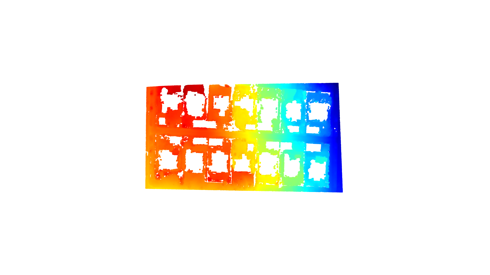

This is a project that follows the 3D Point Cloud Vectorization for LiDAR City Models tutorial available at: https://learngeodata.eu/vectorization-of-3d-point-cloud-for-lidar-city-models/

So far, I have created the following visualizations from LiDAR data:

